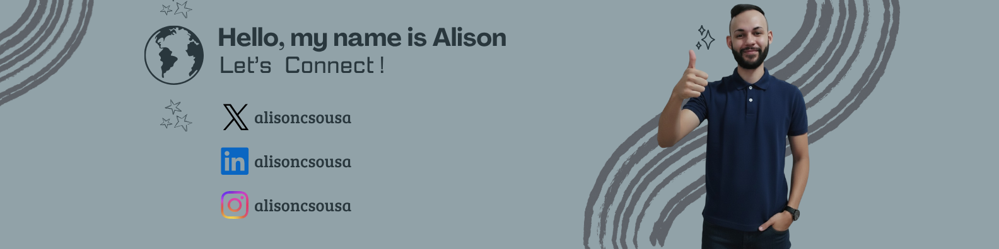

### Hi there 👋, Welcome!

Hello!👋🏻 My name is Alison Sousa. I am from University of São Paulo, taking a BSc in Chemical Engineering. I also earned a BA in International Relations from ESPM/SP. 🎓

I have a huge interest in AI🤖! Founder of SMTech, and experience in quantitative analysis at China Construction Bank.

I love strategy games like Go and chess♟️, boxing🥊, and support FC Barcelona⚽.

I enjoy joining communities and competitions that create something impactful for society! 🙋

**Skills:**  
Data Engineering | Data Science | Project Management  

**Tools:**   

- 🔭 I’m currently working on this page. 
- 🌱 I’m currently learning ReactJS 
- 📫 How to reach me: alisoncsousa (Twitter, Linkedin, Instagram) 
- 😄 Pronouns: He/Him 
- ⚡ Fun fact: I once solved a Rubik’s Cube in under a minute just to impress my friends!  

[<title>X</title><path d='M18.901 1.153h3.68l-8.04 9.19L24 22.846h-7.406l-5.8-7.584-6.638 7.584H.474l8.6-9.83L0 1.154h7.594l5.243 6.932ZM17.61 20.644h2.039L6.486 3.24H4.298Z'/></svg>">](https://x.com/alisoncsousa)

